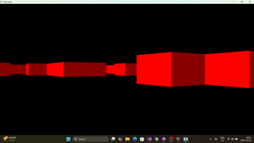

# 🔦 Raycaster 2.5D (C++ / SFML)

**2.5D raycaster** inspired by *Wolfenstein 3D* and *DOOM (1993)*, built with **C++** and **SFML**.  
Uses the **DDA (Digital Differential Analyzer)** algorithm for raycasting.

---
## 👀 Preview

---
## 🚀 Current Features

✅ **DDA Raycasting** — accurate and efficient wall detection and rendering  

✅ **Player movement** — walk forward/backward and strafe smoothly  

✅ **Camera rotation** — look left and right using keyboard input

✅ **Object rendering** — able to render moving objects like decorations or enemies

✅ **Configurable Maps / Map Loading** — design custom .txt maps that are automatically read and converted into a 2D grid of 1s (walls) and 0s (empty space).

---

## 🧭 Planned / Upcoming Features

🔹 **Textures** Wall, Floor, Roof textures

🔹 **Sprites** (enemies, objects, pickups, Hud etc)

🔹 **Interactive doors / triggers**  

---

## 🎮 Controls

| Key | Action |
|-----|---------|
| `W` | Move forward |
| `S` | Move backward |
| `A` | Strafe left |
| `D` | Strafe right |
| `←` | Turn left |
| `→` | Turn right |
| `ESC` | Quit the game |

---
